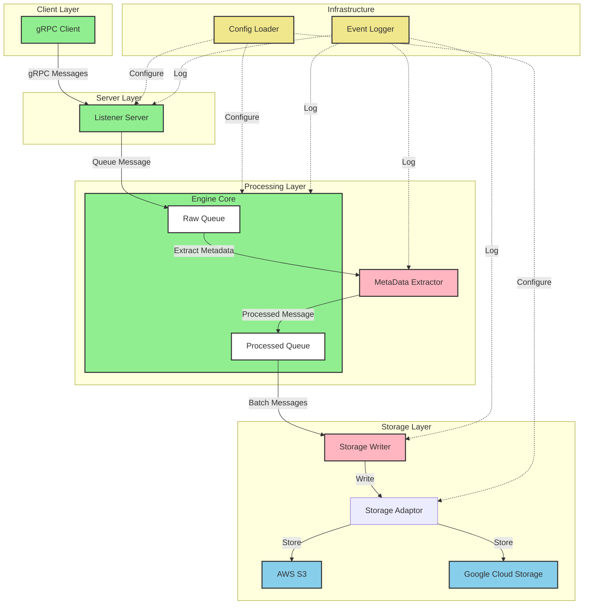

# Rust Storage Engine

A high-performance asynchronous message processing and storage engine built with Rust, featuring gRPC communication and
modular architecture.

## Architecture Overview



## Components

### Core Components:

- **Engine Core**: Central message processing unit
- **Config Loader**: Configuration management
- **Listener Server**: gRPC interface
- **MetaData Extractor**: Message analysis and metadata extraction
- **Storage Adaptor**: Storage interface layer
- **Event Log**: System-wide logging

### Component Details:

- **Listener Server**:
    - Listens for proto messages over gRPC
    - Uses msg.proto for message definitions
    - Queues messages in Engine Core's raw data queue (RDQ)

- **Engine Core**:
    - Central unit for message processing
    - Manages raw data queue (RDQ)
    - Coordinates parallel metadata extraction
    - Handles processed message queue
    - Manages FMM entity preparation and batch compression

- **Storage Adaptor**:
    - Plugin interface for different storage backends
    - Supports GCP cloud storage and S3
    - Config-driven storage selection

- **Event Log**:
    - Unified logging interface
    - Comprehensive message processing tracking
    - Integration with upstream logging systems

## Technical Stack

- **Async Runtime**: Tokio
- **gRPC Framework**: Tonic
- **Serialization**: Prost (Protocol Buffers)
- **Logging**: Tracing
- **Error Handling**: thiserror
- **Configuration**: Serde

## Development

### Prerequisites

- Rust 1.70+
- Protocol Buffers compiler
- Make (for build scripts)

### Build Commands

```bash
make build       # Build the project
make test        # Run tests
make lint        # Run clippy and format checks
make run         # Run the server
make run-client  # Run the test client
make doc         # Generate documentation
```

### Feature Flags

- `client`: Enables client code compilation
- Default features include server-side functionality

## Project Structure

```
.
├── src/
│   ├── config.rs     # Configuration structures
│   ├── core.rs       # Engine Core implementation
│   ├── error.rs      # Error types
│   ├── proto/        # Protocol buffer implementations
│   ├── server.rs     # gRPC server implementation
│   └── storage/      # Storage adaptor interfaces
├── proto/
│   └── msg.proto     # Protocol buffer definitions
└── examples/
    └── grpc_client.rs # Test client implementation
```

## Roadmap

### Q2 2024

- [ ] Complete MetaData Extractor implementation
- [ ] Implement basic Storage Writer functionality
- [ ] Add message compression

### Q3 2024

- [ ] Implement AWS S3 storage adaptor
- [ ] Add Google Cloud Storage support
- [ ] Optimize batch processing

### Q4 2024

- [ ] Add monitoring and metrics
- [ ] Implement advanced error recovery
- [ ] Add support for custom storage backends

## Contributing

Contributions are welcome! Please check our contributing guidelines for more information.

## License

[MIT License]