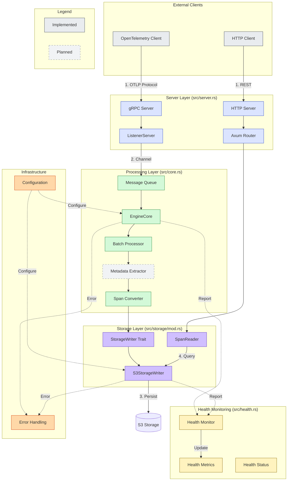

# OpenTelemetry Storage Engine

A high-performance asynchronous trace storage engine built with Rust, featuring OpenTelemetry protocol support, S3-compatible storage, and health monitoring.

## Features

- **OpenTelemetry Support**
  - OTLP protocol implementation
  - Trace collection and storage
  - Span batching and processing

- **Storage**
  - S3-compatible backend
  - Configurable batching
  - Efficient data organization

- **Monitoring**
  - Health check endpoints
  - Performance metrics
  - Error tracking

- **API**
  - gRPC for trace collection
  - REST for querying spans
  - Health status endpoints

## Quick Start

1. **Prerequisites**
```bash
# Required tools
- Rust 1.70+
- Docker
- AWS CLI
```

2. **Setup LocalStack**
```bash
# Start LocalStack
docker run --rm -it -p 4566:4566 localstack/localstack

# Create test bucket
aws --endpoint-url=http://localhost:4566 s3 mb s3://my-test-bucket
```

3. **Run the Server**
```bash
# Build and run with logging
RUST_LOG=info cargo run
```

4. **Test with Example Client**
```bash
# Run the test client
RUST_LOG=info cargo run --example grpc_client --features client
```

## Architecture



### Component Details

1. **Server Layer** `(Implemented)`
   - Handles incoming OTLP and HTTP requests
   - Routes requests to appropriate handlers
   - Manages connection lifecycle

2. **Processing Layer**
   - `EngineCore`: Central processing unit `(Implemented)`
   - `Message Queue`: Async message handling `(Implemented)`
   - `Metadata Extractor`: Span metadata analysis `(Planned)`
   - `Batch Processor`: Efficient batch operations `(Implemented)`

3. **Storage Layer** `(Implemented)`
   - Abstract storage interface
   - S3-compatible implementation
   - Span querying capabilities
   - Data organization

4. **Health Monitoring** `(Implemented)`
   - System health tracking
   - Performance metrics
   - Resource utilization
   - Error rate monitoring

5. **Infrastructure**
   - Configuration management `(Implemented)`
   - Error handling `(Implemented)`
   - Logging and metrics `(Implemented)`

### Planned Features

1. **Metadata Extractor**
   - Service dependency mapping
   - Performance pattern detection
   - Anomaly identification
   - Relationship analysis

## API Reference

### gRPC Endpoints
- `/opentelemetry.proto.collector.trace.v1.TraceService/Export`
  - Accepts OTLP trace data
  - Batches and stores spans

### HTTP Endpoints
- `GET /spans`
  - Query recent spans
  - Optional limit parameter
- `GET /health`
  - System health status
  - Performance metrics

## Configuration

Configuration can be provided via:
1. Environment variables
2. YAML configuration file
3. Default values

### Environment Variables
```bash
SERVER_HOST=0.0.0.0
SERVER_PORT=50051
STORAGE_BUCKET=my-test-bucket
RUST_LOG=info
```

### YAML Configuration
```yaml
server:
  host: "0.0.0.0"
  port: 50051
storage:
  bucket: "my-test-bucket"
  prefix: "traces"
processing:
  batch_size: 100
  batch_timeout_ms: 5000
```

## Development

### Build Commands
```bash
make setup-proto  # Setup OpenTelemetry protos
make build       # Build the project
make test        # Run tests
make lint        # Run lints
make run         # Run server
make run-client  # Run test client
```

### Project Structure
```
.
├── proto/              # Protocol definitions
├── src/
│   ├── config/        # Configuration
│   ├── core/          # Processing engine
│   ├── health/        # Health monitoring
│   ├── proto/         # Generated code
│   ├── server/        # gRPC server
│   └── storage/       # Storage backend
└── examples/          # Usage examples
```

### Testing
```bash
# Unit tests
cargo test

# Integration tests
cargo test --test '*'

# With logging
RUST_LOG=debug cargo test
```

## Contributing

1. Fork the repository
2. Create a feature branch
3. Make your changes
4. Run tests and lints
5. Submit a pull request

## License

[MIT License](LICENSE)